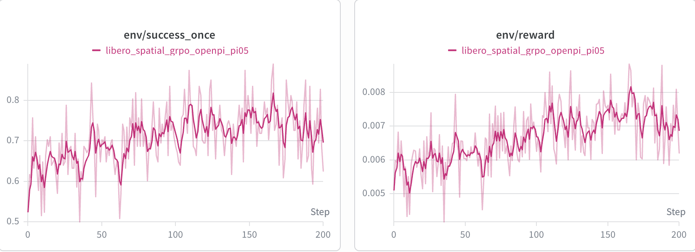
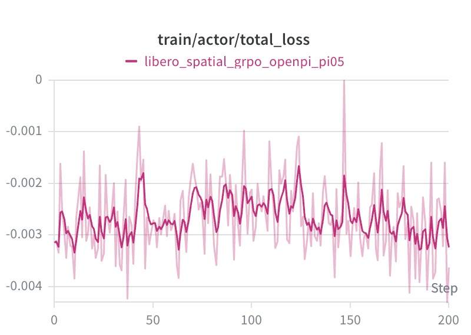
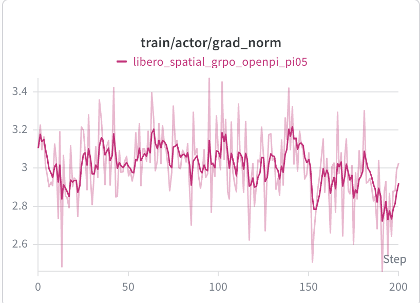
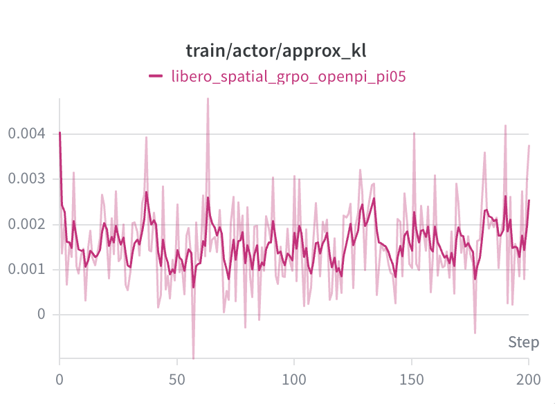
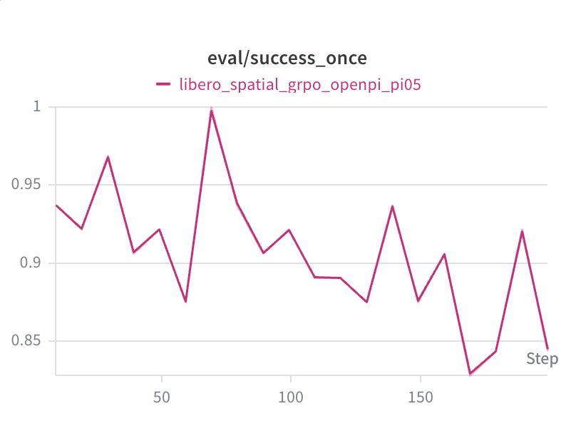

# Wan on Kunlun p800
This recipe is an example of GRPO training for the pi model on P800, using LIBERO simulator. For more information, please refer to the official [RLinf Pi documentation](https://rlinf.readthedocs.io/en/latest/rst_source/examples/embodied/pi0.html).

## Required RLinf Version
Required the release/kunlun-v1.7.0 branch of [RLinf](https://github.com/KunlunxinAD/RLinf), last commit: 9c575b9
## Training Details
### Training Resources and Performance
This example used two nodes: one node has 16 Kunlun P800s, and the other has 1 RTX 5050. The deployment setup:

| Rollout | Actor | Env |
|:----:|:----:|:----:|
|  TP1 DP8  |  TP1 DP8  |  DP1 libero envs=8  | 

The training performance for one step:
|  Step time(s) | Rollout time(s) | Actor train time(s) | Env interact time(s) |
|:----:|:----:|:----:|:----:|
|  1229.744 |  1155.530  |  50.771 |  1156.886  |

### Training Log
<p align="center">
  
</p>

## Quick Start

### Env Setup
To set up the P800 environment for RLinf pi, you can use the install.sh. 
```bash
bash install.sh
```
You can use the provided Dockerfile to set up the environment on the simulation node.
```bash
docker build -f DockerFile.env -t rlinf-kunlun:env .
```

### Download Model Weights
```bash
curl -LsSf https://hf.co/cli/install.sh | bash
hf download RLinf/RLinf-Pi05-LIBERO-SFT
hf download RLinf/openpi_tokenizer
```

### Run RL Training
```bash
# Replace the model path in the config file with the actual model path. You can also adjust the cluster.component_placement configuration as needed.
# Set the correct RLinf path and openpi tokenizer path in run_embodiment.sh.

# Training node（p800）
ip route get RTX_5050_IP_address

export RLINF_NODE_RANK=0
export RLINF_COMM_NET_DEVICES=<interface used to access the RTX 5050 node>
ulimit -n 524288 && ray start --head --num-gpus=16 --port=6379 --node-ip-address=<p800 ip address> --object-store-memory=$((256 * 1024 * 1024 * 1024))

# Sim node（RTX 5050）
ip route get P800_IP_address

export RLINF_NODE_RANK=1
export RLINF_COMM_NET_DEVICES=<interface used to access the p800 node>
ulimit -n 524288 && ray start --num-gpus=1 --address=<p800 ip address:6379>  --object-store-memory=$((256 * 1024 * 1024 * 1024))

cd RLinf-kunlun-recipe
bash embodiment/pi/run_embodiment.sh libero_spatial_grpo_openpi_pi05
```

### Verify Training Accuracy
```bash
# Convert the saved training checkpoint to Hugging Face format.
# Update the model path in YOUR_PATH/RLinf/rlinf/utils/ckpt_convertor/fsdp_convertor/config/fsdp_model_convertor.yaml.
cd /YOUR_PATH/RLinf
REPO_PATH=/YOUR_PATH/RLinf PYTHONPATH=/YOUR_PATH/RLinf:$PYTHONPATH EMBODIED_PATH="$( cd "$(dirname "${BASH_SOURCE[0]}" )" && pwd )" python -m rlinf.utils.ckpt_convertor.fsdp_convertor.convert_pt_to_hf --config-path /YOUR_PATH/RLinf/rlinf/utils/ckpt_convertor/fsdp_convertor/config --config-name fsdp_openpi_convertor convertor.train_config_path=/YOUR_PATH/RLinf-kunlun-recipe/embodiment/pi/config/libero_spatial_grpo_openpi_pi05.yaml
# Update the model path of libero_spatial_openpi_pi05_eval.yaml. Also update total_num_envs; its value must be a multiple of the number of devices used.
bash ./evaluations/run_eval.sh libero libero_spatial_openpi_pi05_eval
```