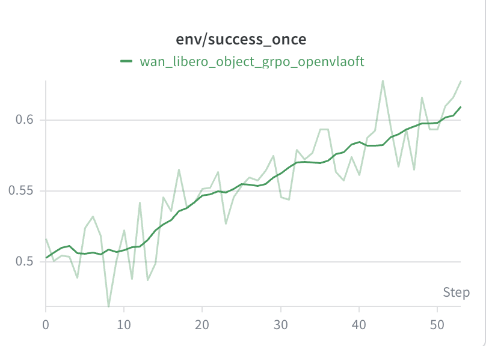
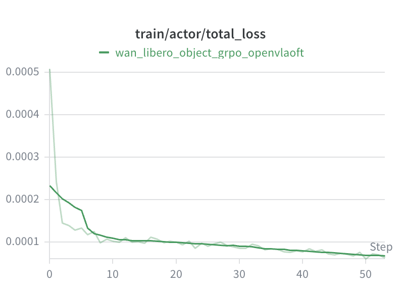
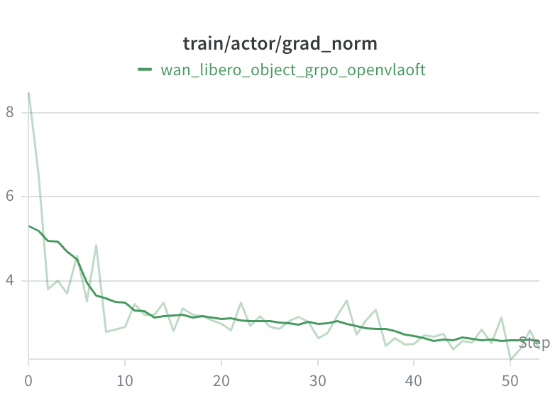
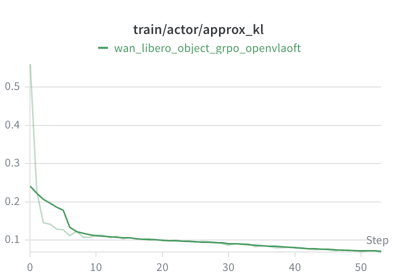
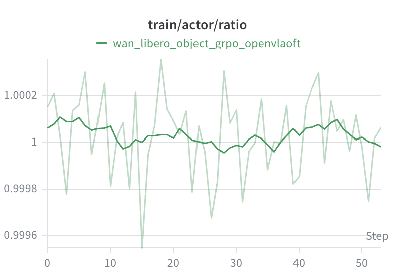
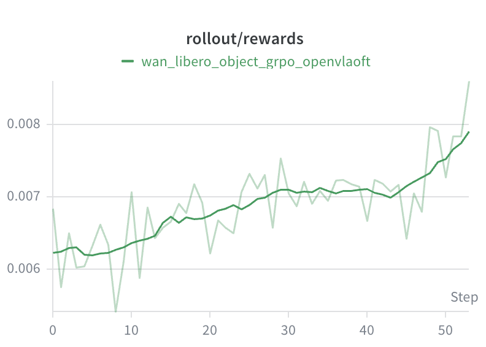

# Wan on Kunlun p800
This recipe is an example of GRPO training for the OpenVLA-OFT model on P800, using a LIBERO environment simulated by the Wan world model. For more information, please refer to the official [RLinf WAN documentation](https://rlinf.readthedocs.io/en/latest/rst_source/examples/embodied/wan.html).

## Required RLinf Version
Required the release/kunlun-v1.7.0 branch of [RLinf](https://github.com/KunlunxinAD/RLinf), last commit: 9c575b9
## Training Details
### Training Resources and Performance
This example was trained on 16 Kunlun P800s. The deployment setup:

| Rollout | Actor | Env |
|:----:|:----:|:----:|
|  TP1 DP4  |  TP4 DP1  |  TP1 DP8  | 

The training performance for one step:
|  Step time(s) | Rollout time(s) | Actor train time(s) | Env generation time(s) |
|:----:|:----:|:----:|:----:|
|  4452.141 |  2189.258  |  2249.154 |  2187.164  |

### Training Log
<p align="center">
  
</p>

## Quick Start

### Env Setup
To set up the P800 environment for RLinf wan, use the base image we provide, and then run the install script in the project directory.
```bash
bash install.sh
```

### Download Model Weights
```bash
curl -LsSf https://hf.co/cli/install.sh | bash
hf download RLinf/RLinf-Wan-LIBERO-Object
hf download Haozhan72/Openvla-oft-SFT-libero-object-traj1
```

### Run RL Training
```bash
# Replace the model path in the config file with the actual model path. You can also adjust the cluster.component_placement configuration as needed.
# Set the correct RLinf path in run_embodiment.sh.
ulimit -n 524288 && ray start --head --num-gpus=16
cd RLinf-kunlun-recipe
bash embodiment/wan/run_embodiment.sh wan_libero_object_grpo_openvlaoft
```

### Verify Training Accuracy
Validation requires NVIDIA hardware, such as an A800 GPU.
```bash
# Convert the saved training checkpoint to Hugging Face format.
# Update the model path in YOUR_PATH/RLinf/rlinf/utils/ckpt_convertor/fsdp_convertor/config/fsdp_model_convertor.yaml.
REPO_PATH=/YOUR_PATH/RLinf python -m rlinf.utils.ckpt_convertor.fsdp_convertor.convert_pt_to_hf --config-path /YOUR_PATH/RLinf/rlinf/utils/ckpt_convertor/fsdp_convertor/config --config-name fsdp_model_convertor
# Update the model path on line 69 of /YOUR_PATH/RLinf/evaluations/libero/libero_object_openvlaoft_eval.yaml. Also update total_num_envs on line 41; its value must be a multiple of the number of devices used.
bash /YOUR_PATH/RLinf/evaluations/run_eval.sh libero libero_object_openvlaoft_eval
```