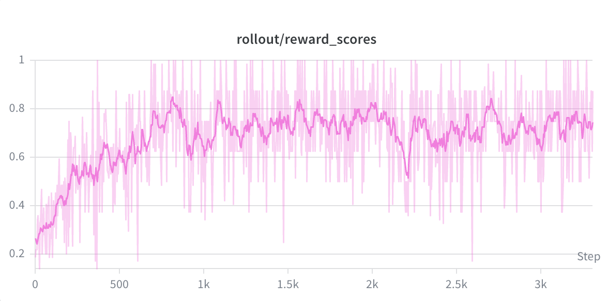
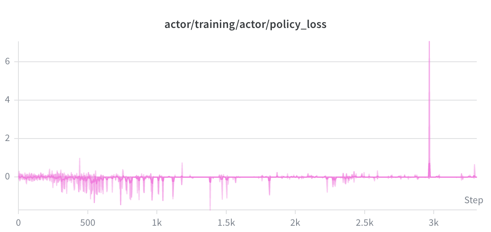
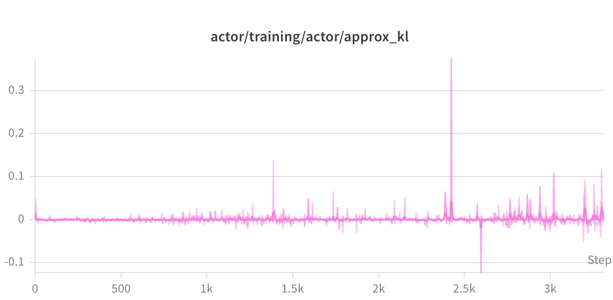

# Qwen2.5vl 3b on Kunlun p800
本recipe是基于qwen2.5vl-3b模型在p800上进行RLHF后训练的样例，基于GRPO与规则奖励，使用Robo2VLM-1数据集。
## 依赖的 `RLinf` 版本

依赖[RLinf](https://github.com/KunlunxinAD/RLinf)的klx_dev分支，commit：b3d8aeb。

## 训练细节
### 训练超参

本样例基于qwen2.5vl-3b模型在Robo2VLM-1数据集上训练，使用简单的格式奖励和结果准确率奖励，训练超参如下：

|  迭代  | 学习率 |  gbs  |  采样数 | 温度 |  kl-coef | 输入长度 | 输出长度 | 规则奖励 | 奖励模型 |
|:----:|:----:|:----:|:----:|:----:|:----:|:----:|:----:|:----:|:----:|
| 1000 | 2e-5 |  8  |  8  |  1.0  |  0.0  |  1024  |  1024  |  acc  | - |

### 训练资源与性能
本样例在昆仑p800 16卡服务器上进行训练，使用了12张p800。具体的部署方式如下：

| Rollout部署 | Actor部署 | Reference部署 | Offload策略 |
|:----:|:----:|:----:|:----:|
|  TP1 DP4  |  TP1 DP4  |  同Actor  |  非offload |

得到一步的训练性能如下（吞吐会随着训练中模型输出长度变化而改变）：
| 平均问题长度 |  平均回复长度  |  单步总耗时(s) | rollout耗时(s) | actor train耗时(s) | inference耗时(s) |
|:----:|:----:|:----:|:----:|:----:|:----:|:----:|
| 265.1 |  27.5  |  70.6 |  3.7  |  45.3 |  13.4  |

### 训练过程记录
<div align="center">
  
  
  
</div>

## 快速开始

### 环境准备
rlinf上的p800环境准备，可使用我们提供的Dockerfile在本地构建项目运行环境：`docker build -f Dockerfile.kunlun_rlinf.torch2.9 -t REPOSITORY:TAG ./`。
进入容器后，需要在目录`/workspace/vllm`下运行 `bash scripts/build.sh build`完成vllm安装。

### 准备训练数据集
本样例使用Robo2VLM-1数据集。准备方式如下：
```bash
hf download keplerccc/Robo2VLM-1 --repo-type=dataset
```

### 准备模型权重
本样例使用qwen3vl-8b模型。准备方式如下：
```bash
pip install modelscope
modelscope download --model Qwen/Qwen2.5-VL-3B-Instruct
```

### 执行RL后训练
```bash
# RLinf目录下启动qwen2.5vl 3b的RL后训练，需要替换脚本中的数据集、模型路径
ray start --head --num-gpus=16
bash RLinf-kunlun-recipe/reasoning/run_main_grpo_vqa.sh
```

### 验证训练精度
```bash
# 将训练保存权重转换至hf格式
python ./tools/convert_pt_to_hf.py --ckpt /path/to/actor/model_state_dict/full_weights.pt  --save-dir /path/to/save
# RLinf目录下启动qwen2.5vl eval脚本，需要替换脚本中的数据集、模型路径
bash RLinf-kunlun-recipe/sft/run_vlm_eval.sh
```
| 模型 |  精度 % |
|:----:|:----:|
| qwen2.5-vl-3b | 28.32 |
| qwen2.5-vl-3b-grpo-800 | 41.96 |